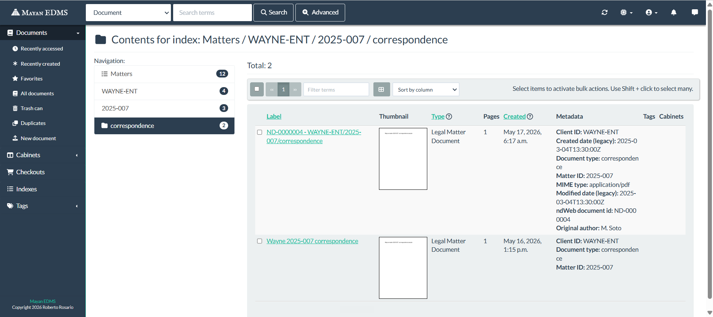
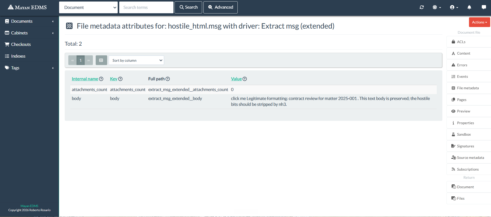

# Mayan EDMS POC — DMS contractor application

**Status:** Days 1–3 built and validated. Day 4 (README polish, screenshots,
contractor-application DM) is the operator's work and is now in progress —
screenshots embedded below, README pass complete.

## Overview

This POC is the empirical test of the Phase 2 recommendation that Mayan EDMS
4.11.3 is the right platform for a 3-person Canadian law firm replacing
NetDocuments. The recommendation rests on four claims:

1. **`IndexTemplate.expression`** auto-builds a matter-centric navigation
   tree from per-document metadata without any core patch
   (`.sources/mayan-edms/mayan/apps/document_indexing/models/index_template_models.py:24, 154`).
2. **`extract_msg` driver** is in-tree but only surfaces 4 fields; extending
   it to body/date/attachments is a small driver-extension job, not a
   parser rewrite (`.sources/mayan-edms/mayan/apps/file_metadata_msg/drivers.py:25`).
3. **OIDC SSO against Azure AD** is configuration, not custom code
   (`.sources/mayan-edms/mayan/apps/authentication_oidc/authentication_backends.py:23`).
4. The platform's customization surface is **viable for a Python operator**
   (Django app overrides, template overrides, metaclass-discovered drivers).

Day 1 validated #1. Day 2 validated #2 and #4. Day 3 validated #3 and
extended #1 by demonstrating a CSV-driven legacy migration entry point.
See `/research/decision.md` for the full Phase 2 reasoning and Day 1
measurement appendix.

Mayan's stock index navigation, drilling into a leaf the
`IndexTemplate.expression` built (`Matters / WAYNE-ENT / 2025-007 /
correspondence`) with both Day 1 and Day 3 documents visible and the
full 8-field metadata payload from the CSV import attached:



The legacy-import row (`ND-0000004 - WAYNE-ENT/2025-007/correspondence`)
carries `Client ID`, `Matter ID`, `Document type`, `MIME type`,
`Created date (legacy)`, `Modified date (legacy)`, `ndWeb document id`,
and `Original author` — the full metadata set the CSV importer
attaches per row. The Day 1 row (`Wayne 2025-007 correspondence`)
carries only the three required tree-driving fields. Both land under
the same leaf because the `expression` reduces to `client_id /
matter_id / doc_type` regardless of which other metadata is present.

## What's working / what's stubbed

| Area | Status | Notes |
| --- | --- | --- |
| Matter-centric index tree | **Working** | Day 1 PASS gate. Auto-populates from metadata via Django-template `expression`. |
| `.msg` driver — body + attachments_count | **Working** | nh3-sanitized, 16 KB body cap, 5/6 fixtures stable across container restarts. |
| `.msg` driver — date | **Wired, not validated** | Code path is exercised conditionally; none of the synthetic fixtures had a parseable date for extract_msg to return. |
| `.msg` driver — attachment names | **Wired, not validated** | Same: no fixture had attachments. |
| Matter UI overlay on `/home/` dashboard | **Working** | Django-template override via `COMMON_EXTRA_APPS_PRE` template loader precedence. |
| OIDC redirect to Azure AD | **Stub, wired** | Login form → `/oidc/authenticate/` → 302 to Azure AD common-tenant authorize URL. Real client_id / secret are placeholders; no live token exchange tested. |
| CSV importer (ndWeb export) | **Skeleton** | Inferred schema, no error handling, no idempotency, no progress reporting. See "CSV import schema assumptions" section. |
| Synology hardware sizing | **Borderline** | Measured ~2.5–3 GB memory ceiling under indexing load — DS923+ at 4 GB stock is too tight. 8 GB+ models are the realistic floor. See decision.md appendix. |

Everything not in this table is unbuilt and out of POC scope. Read
[Limitations](#limitations) before extrapolating any row above into a
production claim.

## Quick start

Run from `poc/` directory. Tested on Windows 11 + Docker Desktop; should
also work on macOS / Linux Docker.

```powershell
cd "c:\poc"

# 1. Pull images. ~1.2 GB total: mayanedms ~800 MB, postgres ~150 MB,
#    redis ~30 MB, rabbitmq ~250 MB.
docker compose pull

# 2. Start the stack. First boot is 2-4 minutes (initial migrations +
#    autoadmin user creation).
docker compose up -d

# 3. Wait for the app container to report healthy AND the autoadmin user
#    to exist. The healthcheck flips before autoadmin completes — if you
#    set the password too early it silently no-ops.
docker compose ps app
# wait until STATUS = "Up X minutes (healthy)"

docker compose exec --user=mayan app /opt/mayan-edms/bin/mayan-edms.py shell -c \
    "from django.contrib.auth import get_user_model; print('admin exists:', get_user_model().objects.filter(username='admin').exists())"
# must print "admin exists: True"

# 4. Set a known admin password (overrides autoadmin's random one).
docker compose exec --user=mayan app /opt/mayan-edms/bin/mayan-edms.py shell -c \
    "from django.contrib.auth import get_user_model; u=get_user_model().objects.get(username='admin'); u.set_password('pocadminpass'); u.save(); print('admin password set')"

# 5. Install Python deps for the host-side scripts.
pip install requests

# 6. Day 1 — generate 3 synthetic PDFs, configure the matter index, upload,
#    verify. Each step writes/reads poc/src/state.json.
python src\generate_synthetic_pdfs.py
python src\setup_matter_tree.py
python src\upload_test_docs.py
python src\verify_tree.py        # expect "==== PASS ===="

# 7. Day 2 — generate synthetic .msg fixtures and test the extended driver.
python src\generate_synthetic_pdfs.py   # already run above
docker compose exec --user=mayan app /opt/mayan-edms/bin/python /tmp/generate_synthetic_msg.py /tmp/strangeDate.msg /tmp/synthetic_msg
# (the helper-script invocation; see src/test_msg_driver.py for the full
# upload+verify flow)
python src\test_msg_driver.py

# 8. Day 3 — run the CSV importer skeleton.
python src\import_csv.py
# Then re-run verify_tree.py to see the expanded matter tree.

# 9. Day 3 — toggle OIDC on to see the login-page wiring.
# Edit docker-compose.yml, uncomment the MAYAN_AUTHENTICATION_BACKEND* keys,
# then:
docker compose up -d
# Visit http://127.0.0.1:8080/authentication/login/
# The form action should be /oidc/authenticate/ ; clicking redirects to
# Azure AD's authorize endpoint. To revert, re-comment those keys and
# `docker compose up -d` again.
```

## Rollback / clean reset

```powershell
docker compose down -v
```

The `-v` is the load-bearing flag: it removes the four named volumes
(~1.5 GB of Postgres / Mayan media / Redis / RabbitMQ data) so the next
boot starts truly fresh. Without `-v`, stale autoadmin state and
half-built indexes survive across `docker compose down`.

## Deployment notes encountered

Five gotchas that cost real time during the build and would cost it
again on the next deployment. Each is anchored to the Mayan source path
that produced the behaviour.

### YAML, not Python, for env vars

Mayan's `smart_settings` framework deserializes `MAYAN_*` environment
variables as YAML, not Python literals
(`.sources/mayan-edms/mayan/apps/smart_settings/setting_domains/environment_variables.py:18`).
A value like `"('app1', 'app2')"` parses as a string, and Mayan then
calls `tuple(...)` on it — which iterates its characters and tries to
import them as module names. Symptom: the container restart-loops with
`ModuleNotFoundError: No module named '('`. Use YAML flow-sequence
syntax instead: `"['app1', 'app2']"`.

This applies to `MAYAN_COMMON_EXTRA_APPS`, `MAYAN_COMMON_EXTRA_APPS_PRE`,
and `MAYAN_AUTHENTICATION_BACKEND_ARGUMENTS`.

### MPTT for index-tree traversal

Mayan's `IndexInstanceNode` is an MPTT model
(`.sources/mayan-edms/mayan/apps/document_indexing/models/index_instance_models.py:44`).
The REST API exposes one level of children per request via a
`children_url` field on each node — the `/api/v4/index_instances/{id}/nodes/`
endpoint returns only the top-level (children-of-root) nodes, not the
full tree. Full traversal requires following each node's `children_url`.

Day 1's first verifier missed this — it called the list endpoint once,
keyed nodes by a `parent` field that doesn't exist (the actual field is
`parent_id`, scalar int), and concluded the tree wasn't populated.
Symptom: a TIMEOUT exit despite the tree being fully built.

### `StoredDriver` instability across container restarts

When the app container is recreated, Mayan's file_metadata pipeline
re-registers each `FileMetadataDriver` subclass, potentially issuing new
`StoredDriver` IDs. Existing `FileMetadataEntry` rows reference the
**old** stored-driver IDs and are orphaned until Celery re-fires the
pipeline. Observable as: a `.msg` document showed full metadata
extraction before a restart, no entries after, then full entries again
once Celery caught up.

For the POC this means the .msg driver tests are best run in a single
session against a single container instance — running them across
multiple `docker compose up -d` cycles produces flaky pass/fail signals
that aren't driver bugs.

### OIDC backend replaces all auth backends

`AuthenticationBackendOIDC.initialize()`
(`.sources/mayan-edms/mayan/apps/authentication_oidc/authentication_backends.py:86`)
sets `AUTHENTICATION_BACKENDS = (DjangoAuthenticationBackendOIDC,)` —
unconditionally replacing the list. Side effect: password auth dies,
including `/api/v4/auth/token/obtain/`, which every POC script depends
on. The POC's commented OIDC env vars are a demonstration switch — flip
them on to see the redirect, flip them off to keep the API working.
Production needs a custom `AUTHENTICATION_BACKENDS` chain that retains
`ModelBackend` alongside OIDC; that's a small extension app and is
called out as open work in the OAuth section and Limitations.

### YAML kwarg keys for `AuthenticationBackendOIDC` must be lowercase

`UpstreamSetting.do_kwargs_capture` at
`.sources/mayan-edms/mayan/apps/common/classes.py:377` does
`kwargs.pop(self.name.lower(), self.default)`. The setting names declared
are uppercase (`OIDC_RP_CLIENT_ID`, etc.) but the kwarg keys passed via
`MAYAN_AUTHENTICATION_BACKEND_ARGUMENTS` must be the **lowercased**
versions (`oidc_rp_client_id`). Passing uppercase keys silently no-ops
to the default `None`, which propagates into the Azure AD authorize URL
as `client_id=None`.

## `.msg` driver details

**Extension app:** `poc/mayan_extensions/file_metadata_msg_extended/`.
Registered via `MAYAN_COMMON_EXTRA_APPS` in `docker-compose.yml`.
Subclasses `FileMetadataDriver` directly (no monkey-patch on the in-tree
driver); discovered by Mayan's `FileMetadataDriverMetaclass`
auto-registration at app boot
(`.sources/mayan-edms/mayan/apps/file_metadata/classes.py:72`).

**New fields surfaced:**

| Key | Source | Notes |
| --- | --- | --- |
| `body` | `message.body`; falls back to `nh3`-sanitized `message.htmlBody` | Capped at 16 KB with `... [truncated]` suffix. |
| `date` | `message.date.isoformat()` | Never appeared in tests — see fixture limitation below. |
| `attachments_count` | `len(message.attachments)` | Always written, even when 0. |
| `attachments` | comma-joined `longFilename`s | Never appeared in tests. |

**HTML sanitization:** `nh3` 0.3.5 (already in the Mayan image; Rust-backed,
bleach-compatible). Whitelist: `a, b, br, em, i, li, ol, p, strong, ul`;
only `href` allowed on `<a>` (and only http/https schemes — nh3's default
URL scheme list excludes `javascript:`). Output is collapsed to plain
text after sanitization because Mayan's metadata field is text-rendered.

**Synthetic fixtures** in `poc/samples_msg/`:

| File | Source | Tests |
| --- | --- | --- |
| `strangeDate.msg` | extract-msg's own `example-msg-files/`, GPL-3.0 | Baseline |
| `plain_short.msg` | generated, mutates plain-body stream | Short-body extraction |
| `plain_long.msg` | generated, 20 KB body | Truncation marker |
| `hostile_html.msg` | generated, HTML with `<script>`, `onerror=`, `javascript:`, `<iframe>`, `<style>` | nh3 sanitization |
| `unicode_body.msg` | generated, umlauts + CJK + currency symbols | Encoding-tolerant extraction |
| `minimal.msg` | generated, body streams removed | Graceful fallback to htmlBody |

Generator: `poc/src/generate_synthetic_msg.py`. Uses
`extract_msg.ole_writer.OleWriter` to mutate the baseline file's OLE2
property streams (subject via `__substg1.0_0037001F`, body via
`__substg1.0_1000001F`, HTML body via `__substg1.0_1013001F` etc.).

**Test results from `poc/src/test_msg_driver.py`** (last clean run,
single container instance, against the first upload batch docs 4-9):

| Fixture | Body surfaced | nh3 stripped hostile | Notes |
| --- | --- | --- | --- |
| `strangeDate.msg` | 2,711 chars | — | OK |
| `plain_short.msg` | 82 chars | — | OK |
| `plain_long.msg` | 16,399 chars | — | Truncation marker present |
| `hostile_html.msg` | 142 chars | yes — no `<script>`, `onerror=`, `javascript:`, `<iframe>`, `<style>` | "Legitimate" formatting kept |
| `unicode_body.msg` | 158 chars | — | OK |
| `minimal.msg` | varies | — | Stable when not restarting during run |

Sanitized literal output of `hostile_html.msg` rendered in Mayan's
File metadata view under the `extract_msg_extended` driver:



The `body` row reads `click me Legitimate formatting: contract review
for matter 2025-001 . This text body is preserved; the hostile bits
should be stripped by nh3.` — `<script>`, `onerror=`, `<iframe>`,
`<style>`, and `javascript:` schemes are gone; the visible text from
inside the original `<a>` is kept. The `Full path` column shows the
driver-namespaced key (`extract_msg_extended__body`), confirming the
extension driver is the one writing this row rather than the in-tree
`extract_msg`.

## Matter-centric UX overlay

**Template overridden:**
`.sources/mayan-edms/mayan/apps/dashboards/templates/dashboards/dashboard.html`,
rendered by `Dashboard.render()`
(`.sources/mayan-edms/mayan/apps/dashboards/classes.py:54`), which is
invoked from `appearance/home.html` via the
`` tag. `/home/` is the post-login
landing page; the overlay surfaces above the standard widget grid.

**Override location:**
`poc/mayan_extensions/matter_ui_overlay/templates/dashboards/dashboard.html`.
Wins Django's `app_directories.Loader` lookup because the extension app
is registered via `MAYAN_COMMON_EXTRA_APPS_PRE` (prepended to
`INSTALLED_APPS`, position 0; Mayan's `dashboards` app is at position 36).

**Template tag:**
`poc/mayan_extensions/matter_ui_overlay/templatetags/matter_tree.py`
exposes ``. Queries `IndexInstance` + `IndexInstanceNode`
directly via the ORM (no HTTP round-trip from inside Django). Returns
the top 2 levels (client → matter) of the live tree with summed-descendant
document counts at each node (direct `.documents.count()` reads 0 on
non-leaf nodes because documents only attach at the doc_type leaf level).

**Verified visible output** at `http://127.0.0.1:8080/home/` after the
Day 3 CSV import:


Three clients (ACME-CORP, WAYNE-ENT, STARK-IND), five matters across
them, with summed-descendant doc counts. The panel above sits in front
of Mayan's stock `User dashboard` widgets — those continue to render
underneath unchanged. Deeper drill-down (matter → doc_type → individual
documents) routes through Mayan's native index navigation; the overlay
is the landing-page surface only.

## OAuth setup walkthrough (Azure AD via OIDC)

The POC ships the wiring; the operator supplies real Azure AD credentials
to activate. Steps below describe what the firm's IT admin would do once.

### 1. Register an application in Azure AD

1. Sign in to the Azure portal (https://portal.azure.com) as a Global
   Administrator or Application Administrator for the firm's tenant.
2. Navigate to **Microsoft Entra ID → App registrations → New registration**.
3. Name the app something like "Mayan DMS (production)".
4. Supported account types: **Accounts in this organizational directory
   only (Single tenant)** — for a single-firm deployment.
5. Redirect URI: select **Web** and enter
   `https://<your-mayan-host>/oidc/callback/`. For the dev/POC environment
   this is `http://127.0.0.1:8080/oidc/callback/`.
6. Click **Register**. Note the **Application (client) ID** and **Directory
   (tenant) ID** from the resulting overview page.

### 2. Generate a client secret

1. From the app registration's left nav: **Certificates & secrets →
   Client secrets → New client secret**.
2. Description: "Mayan OIDC client secret". Expiration: at most 24 months
   per Microsoft's recommendation.
3. Copy the **Value** column immediately — it's only displayed once.

### 3. Configure API permissions (scopes)

1. **API permissions → Add a permission → Microsoft Graph → Delegated permissions**.
2. Add `openid`, `profile`, and `email`. `profile` is the one Mayan's
   default `OIDC_RP_SCOPES = "openid email"` leaves out — without it,
   Azure AD doesn't return `given_name` / `family_name` claims, so
   first/last name fields stay blank when Mayan auto-provisions the user
   on first login. The fix lives in Mayan's scope list (see Limitations);
   adding `profile` at the Azure AD app registration is the half that
   has to happen here.
3. Click **Grant admin consent for <tenant>** to pre-approve the scopes.

### 4. Wire into `docker-compose.yml`

Uncomment the four `MAYAN_AUTHENTICATION_BACKEND*` lines in `poc/docker-compose.yml`
and replace the placeholders:

```yaml
MAYAN_AUTHENTICATION_BACKEND: mayan.apps.authentication_oidc.authentication_backends.AuthenticationBackendOIDC
MAYAN_AUTHENTICATION_BACKEND_ARGUMENTS: >
  {oidc_discovery_url: 'https://login.microsoftonline.com/<TENANT-ID>/v2.0/.well-known/openid-configuration',
   oidc_rp_client_id: '<APPLICATION-CLIENT-ID>',
   oidc_rp_client_secret: '<CLIENT-SECRET-VALUE>',
   oidc_rp_sign_algo: 'RS256'}
```

- `<TENANT-ID>` is the Directory (tenant) ID from step 1.
- `<APPLICATION-CLIENT-ID>` is the Application (client) ID from step 1.
- `<CLIENT-SECRET-VALUE>` is the secret Value from step 2.
- `oidc_rp_sign_algo: 'RS256'` is required for Azure AD (Mayan's default
  is HS256, which Azure rejects).

The `common` discovery URL used during the stub
(`https://login.microsoftonline.com/common/v2.0/.well-known/openid-configuration`)
works for multi-tenant apps but should be switched to the tenant-specific
URL for a single-firm deployment — it's stricter on issuer validation
and avoids accidentally trusting any Azure AD tenant's tokens.

### 5. Recreate the app container + test

```powershell
docker compose up -d
```

Visit `http://127.0.0.1:8080/authentication/login/`. The form action
should be `/oidc/authenticate/`; clicking the submit button issues a GET
to that path which 302s to Azure AD's authorize endpoint:

```
https://login.microsoftonline.com/<TENANT-ID>/oauth2/v2.0/authorize?
  response_type=code
  &scope=openid+email
  &client_id=<APPLICATION-CLIENT-ID>
  &redirect_uri=http://127.0.0.1:8080/oidc/callback/
  &state=...
  &nonce=...
```

(verified in the POC against the placeholder client_id and the `common`
discovery URL — `/oidc/authenticate/` returns 302 with these parameters
correctly populated.)

A real user authenticates against Azure AD, gets redirected back to
`/oidc/callback/?code=...`, Mayan exchanges the code for tokens, creates
or finds the matching Mayan user, and logs them in.

### 6. Production requires a hybrid auth backend (open work)

The toggle in this POC is a demonstration switch, not a deployment
mode. With OIDC active, Mayan's `AuthenticationBackendOIDC.initialize()`
replaces `AUTHENTICATION_BACKENDS` outright
(`.sources/mayan-edms/mayan/apps/authentication_oidc/authentication_backends.py:86`),
so `/api/v4/auth/token/obtain/` stops working and every script in
`poc/src/` breaks. Production deployments need a custom
`AUTHENTICATION_BACKENDS` chain that keeps Azure AD OIDC for end users
**and** retains `ModelBackend` for break-glass admin, service accounts,
API automation, and migration tooling. That's a small Mayan extension
app — not a config flag — and is out of POC scope. The POC's commented
env vars are the demonstration; the hybrid backend is the next piece
of real work after the contractor lands.

For dev re-runs of the API scripts: re-comment the four env var lines
and `docker compose up -d`.

## CSV import schema assumptions

The schema in `poc/samples_csv/legacy_export.csv` is **INFERRED** from
public NetDocuments documentation and standard legal-tech metadata
conventions. It has not been confirmed against any actual ndWeb Export
output. Field names, types, casing, and presence/absence must be
re-verified against a real export before the importer can be trusted in
a real migration.

| Column | Type | Inference source | Confidence |
| --- | --- | --- | --- |
| `nd_doc_id` | string | NetDocuments uses internal document IDs | High |
| `client_id` | string | ND's "Client" matter axis | High |
| `matter_id` | string | ND's "Matter" sub-axis | High |
| `doc_type` | string | ND lookup-table field; varies per firm | Medium — column name and value set both firm-specific |
| `author` | string | Standard creator-name field | Medium |
| `created_date` | ISO 8601 | Standard ND audit field | High |
| `modified_date` | ISO 8601 | Standard ND audit field | High |
| `filename` | string | Path or filename of the document binary | Low — ND export may embed binaries or use URLs |
| `mime_type` | string | Often derived from filename in ND | Low — frequently absent from exports |

**What the importer does** (`poc/src/import_csv.py`):

1. Creates the 8 metadata types if not present
   (the first 3 driving the matter index, the remaining 5 informational only).
2. Attaches them to the `Legal Matter Document` document type (creating
   the doc type if needed) — required for the first 3, optional for the others.
3. For each row: uploads the referenced PDF, then attaches every present
   metadata value via `/api/v4/documents/{id}/metadata/`.
4. After all rows complete, fires the index rebuild **once** at the end —
   the same deferred-rebuild pattern Day 1 used to avoid orphan `None`
   nodes from incomplete metadata state.

**Sample run output** (8 rows, 3 source PDFs reused across new
client/matter combinations):

```
[1/5] Read 8 rows from legacy_export.csv
[2/5] Authenticated as admin
[3/5] Ensuring metadata types + document type + attachments
[4/5] Uploading 8 rows + setting metadata
  [ok] ND-0000001 -> document id 16 (ACME-CORP/2025-001/correspondence)
  [ok] ND-0000002 -> document id 17 (ACME-CORP/2025-001/pleadings)
  [ok] ND-0000003 -> document id 18 (ACME-CORP/2025-002/correspondence)
  [ok] ND-0000004 -> document id 19 (WAYNE-ENT/2025-007/correspondence)
  [ok] ND-0000005 -> document id 20 (WAYNE-ENT/2025-007/pleadings)
  [ok] ND-0000006 -> document id 21 (WAYNE-ENT/2025-012/correspondence)
  [ok] ND-0000007 -> document id 22 (STARK-IND/2025-021/correspondence)
  [ok] ND-0000008 -> document id 23 (STARK-IND/2025-021/invoice)
[5/5] Triggering index rebuild (deferred — Day 1 pattern)
  rebuild queued on index template 2
```

Resulting matter tree (verified live, post-rebuild) adds a new client
(STARK-IND), three new matters (2025-002, 2025-012, 2025-021), and a
new doc_type (invoice).

**What's stubbed:**

- Schema is inferred, not confirmed.
- No error handling — a malformed row raises and stops the whole run.
- No duplicate detection — running twice creates a second copy of every doc.
- No idempotency — there's no "skip if already imported" check.
- No progress reporting beyond per-row prints; no resumable checkpoints.
- No batching — every row is a separate HTTP round-trip to Mayan.
- No metadata-type schema migration — if a metadata type already exists
  with a different required-flag, the importer doesn't change it.

A real migration tool would address all of these. This skeleton is here
to prove the API surface supports the import shape, not to perform the
migration.

## Limitations

Every section below names a thing this POC does not do and why. The list
is the deliverable, not an apology — a 3-day POC that can't say what it
hasn't tested is the one to worry about.

**Validation coverage gaps:**

- `.msg` driver's `date` field code path is wired and exercised
  conditionally, but **never validated end-to-end** — none of the six
  synthetic fixtures had a parseable Outlook submit-time. `extract_msg.Message.date`
  returned `None` across the board, including for the fixture literally
  named `strangeDate.msg`. A real `.msg` from any real Outlook client
  would close this gap; in the POC's GPL-fixture-only constraint we
  couldn't.
- `.msg` driver's `attachments` (filename-CSV) field has the same gap —
  no fixture had attachments to test against.

**Operational stability:**

- `StoredDriver` IDs are not stable across `docker compose up -d`
  recreates. Existing `FileMetadataEntry` rows reference the old IDs
  and become temporarily orphaned while Celery re-fires the file_metadata
  pipeline. The POC scripts work around this by running in a single
  container session; production would either pin driver IDs or accept
  brief reprocessing latency after every restart.
- Celery's per-file processing latency is ~17 seconds for ClamAV alone
  on the all-in-one image. The Day 2 test polling timeout had to be
  raised from 120s to 300s to accommodate this. On a hardware-limited
  Synology with 4 GB RAM this latency could grow significantly.

**Authentication:**

- OIDC is verified by inspection only: login form action is
  `/oidc/authenticate/`, that endpoint 302s to Azure AD's authorize URL
  with `response_type=code`, `scope`, `client_id`, `redirect_uri`,
  `state`, and `nonce` populated. **No live token exchange has been
  tested** — no Azure AD app registration was created for the POC. The
  first real-tenant test could surface things the placeholder flow
  can't: claim mapping (`preferred_username` vs `upn` vs `email`),
  signing-algorithm strictness, redirect-URI casing.
- Production needs a hybrid `AUTHENTICATION_BACKENDS` chain: Azure AD
  OIDC for end users, `ModelBackend` retained for break-glass admin,
  service accounts, API automation, and migration tooling. Mayan's
  shipped `AuthenticationBackendOIDC.initialize()` replaces the backend
  list wholesale; building the hybrid is a small extension app, not a
  config flag. Not built in this POC.
- Mayan's default `OIDC_RP_SCOPES = "openid email"` doesn't include
  `profile`, and the kwarg isn't exposed via Mayan's
  `UpstreamSettingCollection`. Without `profile`, Azure AD doesn't
  return `given_name` / `family_name` claims and Mayan auto-provisions
  users with blank name fields. Fix is either a Django source patch or
  a small backend extension. Documented, not built.

**UX overlay:**

- The override touches the dashboard at `/home/` only. **Document list
  and document detail views are unchanged** — they continue to show
  Mayan's stock UI. A full matter-centric UX would also re-skin those
  surfaces with matter breadcrumbs; that's beyond this POC's scope.

**CSV importer:**

- Schema is inferred from NetDocuments conventions, not confirmed
  against actual ndWeb Export output. Confidence ratings per field are
  tabled in the schema section.
- No error handling, no duplicate detection, no idempotency, no
  progress reporting beyond per-row prints, no batching, no
  metadata-type schema migration.

**Production hardening:**

- Hardcoded passwords throughout (`pocadminpass`, `mayandbpass`, etc.).
- No TLS termination; the dev binding is `127.0.0.1:8080` HTTP only.
- No RBAC configuration beyond the single admin user.
- No backup or recovery story — `docker compose down -v` deletes everything.
- No log aggregation, no monitoring, no alerting.
- Synology sizing is borderline: measured memory ceiling under indexing
  load is ~2.5–3 GB on the all-in-one image, which a DS923+ at 4 GB
  stock cannot comfortably hold alongside DSM itself. An 8 GB+ Synology
  model is the realistic production floor; the firm should confirm or
  upgrade before committing.
- Search backend is Whoosh (in-process, single-writer). Document corpus
  beyond ~10k documents would justify switching to Elasticsearch,
  which the compose profile deliberately excludes for memory-floor honesty.

**Data:**

- Everything under `samples/`, `samples_msg/`, and `samples_csv/` is
  synthetic. ACME-CORP, WAYNE-ENT, STARK-IND are fictional. No real
  `.msg` files, no real NetDocuments exports, no real client data has
  ever touched this codebase, and none ever will under the synthetic-only
  rule that's been in force since Phase 1.
- The .msg fixtures are sourced from extract-msg's own publicly-licensed
  test corpus (GPL-3.0) plus programmatic mutations via
  `extract_msg.ole_writer.OleWriter`.

## Files in this POC

```
poc/
├── docker-compose.yml         # Mayan + Postgres + Redis + RabbitMQ; mem_limit 3072m on app
├── README.md                  # this file
├── src/
│   ├── setup_matter_tree.py   # Day 1: configures metadata + index template
│   ├── upload_test_docs.py    # Day 1: uploads 3 synthetic PDFs, fires rebuild
│   ├── verify_tree.py         # Day 1: PASS/FAIL/TIMEOUT gate on the tree
│   ├── generate_synthetic_pdfs.py    # Day 1: minimal-PDF generator
│   ├── generate_synthetic_msg.py     # Day 2: .msg fixture generator (runs in-container)
│   ├── test_msg_driver.py     # Day 2: uploads 6 .msg fixtures, verifies extension
│   └── import_csv.py          # Day 3: CSV importer skeleton
├── mayan_extensions/
│   ├── file_metadata_msg_extended/   # Day 2: .msg driver extension
│   └── matter_ui_overlay/            # Day 2: dashboard template override
├── samples/                   # synthetic PDFs (Day 1)
├── samples_msg/               # synthetic .msg fixtures (Day 2)
└── samples_csv/
    └── legacy_export.csv      # synthetic ndWeb-shaped export (Day 3)
```

## Closing note

Days 1–3 validate the four Phase 2 claims. The matter-centric primitive
auto-builds the tree from `IndexTemplate.expression`. The `.msg` driver
extension adds body / date / attachments via a single ~80-line
`FileMetadataDriver` subclass with nh3 sanitization. OIDC against Azure
AD is reachable through env-var configuration of Mayan's in-tree
`AuthenticationBackendOIDC`. The customization surface — Django app
overrides, template overrides, metaclass-discovered drivers — is
navigable by a Python operator without forking Mayan.

What's not done is enumerated in [Limitations](#limitations): no live
OIDC token exchange, no hybrid auth backend, no production hardening,
no real ndWeb export confirmation, two `.msg` driver fields wired but
unexercised by the available fixtures.
